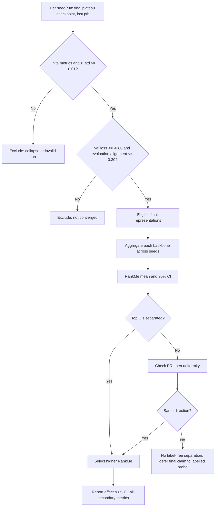

# Etiketsiz Model Seçimi ve Checkpoint Yönetimi

## Bir cümlelik özet

IDH etiketi olmadan bir encoder'ı yalnızca kaybı düşük diye seçmiyoruz: önce eğitimin gerçekten
öğrendiğini ve çökmediğini kanıtlıyor, sonra **kararlı son/plato temsilleri** aynı etiketsiz
kohortta RankMe ile karşılaştırıyor, belirsizliği tohumlar ve güven aralıklarıyla açıkça
raporluyoruz.

Bu belge, güncel unified-cohort deney planı içindir.

| Cohort | Source | Subject count | Role |
|---|---|---:|---|
| BraTS-other | BraTS 2021 | 585 | Unified pretraining cohort |
| UCSF-PDGM | External TCIA collection | 501 | Unified pretraining cohort |
| UPENN-GBM | External TCIA collection | 610 | Unified pretraining cohort |
| **Total** | All collections | **1,696** | Subject-level unified cohort |
| Train split | Fixed subject-level split | 1,526 | Pretraining |
| Monitoring split | Fixed subject-level split | 170 | Label-free validation / selection |

3D ResNet-18, ResNet-34 ve DenseNet-121 aynı split, augmentation ve training budget ile üç
seed'de (42/43/44) çalıştırılır. **Halen süren koşularda winner ilan edilmez**; aşağıdaki kural
tüm koşular bitince önceden belirlenmiş biçimde uygulanır.

---

## Data integration: `data_unified` nasıl oluşturuldu?

`data_unified`, yeni bir görüntü veritabanı ya da voxel-level fusion değildir. Üç fiziksel veri
kaynağını, training code'un tek bir kanonik klasör/dosya şemasıyla okuyabilmesi için oluşturulmuş
**symbolic-link tabanlı bir metadata/erişim katmanıdır**. Görüntü dosyaları kopyalanmadı, yeniden
örneklenmedi veya intensity dönüşümünden geçirilmedi; her çıktı dosyası kaynak `.nii.gz` dosyasına
bir symlink'tir. Böylece disk çoğaltılmaz ve source provenance korunur.

Kanonik çıktı şeması her subject için aynıdır:

```text
data_unified/<collection>/<subject>/<subject>_{t1,t1ce,t2,flair,seg}.nii.gz
```

| Source cohort | Original file naming | Canonical `data_unified` mapping |
|---|---|---|
| BraTS-other | `<sid>_{t1,t1ce,t2,flair,seg}.nii.gz` | Aynı ada doğrudan symlink |
| External UCSF-PDGM | `<sid>_{t1_bias,t1c_bias,t2_bias,FLAIR_bias,seg}.nii.gz` | Sırasıyla `{t1,t1ce,t2,flair,seg}` adına symlink |
| External UPENN-GBM | `{t1,t1ce,t2,flair,seg_automated}.nii.gz` | Sırasıyla `<sid>_{t1,t1ce,t2,flair,seg}.nii.gz` adına symlink |

Bir subject'in dört MRI modality'sinden (`t1`, `t1ce`, `t2`, `flair`) biri eksikse builder o
subject'i cohort'a almaz. `seg` canonical şemaya bağlanır ve `crop_mode=tumor` için yalnız ROI
locator olarak okunur; segmentation ağına input değildir. BraTS içindeki UCSF-PDGM ve UPENN-GBM
collections bilerek atlanır; bunların yerine daha büyük harici TCIA indirimleri kullanılır. Böylece
aynı named cohort'un eski BraTS kopyası ile harici sürümü birlikte sayılmaz.

Üç kaynak BraTS-compatible space'tedir (240×240×155, 1 mm, skull-stripped). Builder aşamasında
**resampling yapılmaz**; cross-cohort intensity scale farkı (harici cohort'larda 8-bit, BraTS'te
16-bit) training sırasında per-channel nonzero z-score ve intensity augmentation ile ele alınır.

Birleştirme bittikten sonra subject-level fixed split (`seed=42`) üretildi: 1,526 training ve 170
label-free monitoring subject. Aynı subject iki split'te bulunmaz. Training code yalnızca
`data_unified` root'unu taradığı için source-specific adlandırma farklarından habersiz çalışır.

Builder script: [`scripts/build_unified_dataset.py`](../scripts/build_unified_dataset.py).

---

## 1. Problem: SSL'de doğrulukla seçim yapamıyoruz

Bu aşamada encoder, MRI'dan iki artırılmış görünümün aynı hastaya ait olduğunu öğrenir (SimSiam).
IDH etiketi ve dolayısıyla AUC/accuracy kullanılmaz. Bu nedenle iki risk vardır:

1. Düşük SSL kaybı tek başına iyi temsil demek değildir; temsil az sayıda yöne sıkışabilir
   (**dimensional collapse**).
2. RankMe de tek başına yeterli değildir: eğitilmemiş, rastgele başlangıç ağında yapay olarak
   yüksek çıkabilir.

Dolayısıyla soru "en küçük loss hangisi?" değil, şudur:

> Aynı eğitim koşullarında, gerçekten yakınsamış ve çökmemiş modeller arasında hangi model en
> zengin ve en kararlı temsili öğrenmiştir?

Bu, yeni bir metrik icat etme iddiası değildir. Katkı; mevcut metrikleri, bilinen hata modlarını
eleyecek deterministik bir karar sırasına yerleştirmektir.

---

## 2. Her metrik hangi soruya cevap veriyor?

| Metrik | Sorduğu soru | Kararda rolü |
|---|---|---|
| `z_std` | Temsil tüm örnekler için sabit bir vektöre mi çöktü? | **Sert kapı:** çok düşükse elenir. |
| Validation SimSiam loss | İki görünümün eşlenmesi öğrenildi mi? | **Yakınsama kapısı**, sıralama ölçütü değil. |
| Alignment | Aynı hastanın iki görünümü feature uzayında yakın mı? | **Yakınsama kapısı**, loss'u tamamlar. |
| RankMe | Varyans kaç efektif doğrultuya yayılıyor? | Geçerli adaylar arasındaki **birincil sıralama ölçütü**. |
| Participation ratio (PR) | Etkin boyutluluk RankMe dışında da yüksek mi? | Yalnız beraberlikte ikinci bağ kırıcı / doğrulayıcı. |
| Uniformity | Temsiller hiperküre üzerinde yığılmadan yayılıyor mu? | Yalnız beraberlikte son bağ kırıcı / doğrulayıcı. |
| Singular-value spectrum, t-SNE | Spektral sonuç tutarlı mı; kohort/scanner kümelenmesi var mı? | Görsel kalite kontrolü; tek başına kazanan seçmez. |

`RankMe=7` demek "256 özelliğin yalnız 7'si bilgi taşıyor" demek değildir. Bu, varyansın az
sayıda doğrultuda yoğunlaştığını söyleyen sürekli bir **efektif-rank** özetidir. Ayırt edici fakat
düşük varyanslı bir doğrultu yine downstream IDH için yararlı olabilir. Bu nedenle RankMe, mutlak
kalite sertifikası değil; etiket gelene kadarki göreli bir vekildir.

---

## 3. Seçimi neden ağırlıklı skorla yapmıyoruz?

Örneğin `0.5 × RankMe - 0.3 × alignment + ...` türü bir skor, üç nedenle uygun değildir:

- Ağırlıklar etiketsiz veri üzerinde keyfi kalır.
- Çökme ve yakınsamama, yüksek RankMe ile telafi edilebilecek ödünleşimler değildir.
- Ölçekleri farklı metrikleri toplamak, küçük bir normalizasyon değişikliğinin kazananı değiştirmesine
  neden olur.

Bu yüzden **leksikografik/kapılı** bir kural kullanılır: önce olmazsa olmaz koşullar, sonra tek
birincil sıralama, ancak istatistiksel beraberlik varsa ikincil metrikler.

---

## 4. Run içi seçim: eğitim sürerken ne oluyor?

Her değerlendirme epoch'unda, aynı sabit izleme kohortunda precise-BN sonrası metrikler hesaplanır.

```text
1. Çökme kapısı
   finite(metrikler) ve z_std >= 0.01 değilse: checkpoint geçersiz.

2. Yakınsama kapısı
   val_loss <= -0.80 ve training-alignment <= 0.15 değilse: henüz geçersiz.

3. Korunan peak kaydı (R1)
   Yalnız 1+2'yi geçen epoch'lar arasında en yüksek RankMe, best.pth olarak saklanır.

4. Erken durdurma
   Sayaç ancak ilk geçerli checkpoint'ten sonra başlar. RankMe iyileşmiyorsa patience sonunda
   eğitim biter; last.pth bu yakınsamış plato sonundaki checkpoint'tir.
```

Bu mekanizma iki şeyi birbirinden ayırır:

- `best.pth` (R1): yakınsama sonrası **korunmuş en yüksek rank** checkpoint'i. Downstream için
  saklanmaya değer bir adaydır.
- `last.pth`: RankMe platosuna ulaşıldıktan sonraki **kararlı son** checkpoint. Backbone/run
  karşılaştırmasının ortak noktası budur.

Bu ayrım önemlidir: `best.pth` dosyasının bulunması, onun backbone yarışmasının karar noktası
olduğu anlamına gelmez.

---

## 5. Why R1 (`best.pth`) cannot select a backbone

`best.pth` geçersiz değildir: convergence gates sonrasında en yüksek RankMe görülen checkpoint'i
saklar. Sorun, bu peak'in backbone comparison için **stable bir measurement point** olmamasıdır.

Önceki 18 tamamlanmış koşuda R1'in mekanik olarak ilk converged evaluation noktasını seçtiği
görüldü. RankMe random initialization'da semantik bilgi nedeniyle değil, rastgele ve daha isotropic
feature variation nedeniyle yüksek olabilir. Convergence gate bu sahte başlangıç peak'ini eler;
fakat converged region'da RankMe çoğunlukla düşüş eğiliminde olduğundan R1 yine transition'ın en dik
kısmındaki ilk eligible epoch'a oturur. Bu beş nedenle backbone comparison'a uygun değildir:

1. **Sampling-grid dependence.** Evaluation her 5 epoch'ta yapıldığında, R1 değeri 5-epoch
   ızgarasının peak'i hangi noktada yakaladığına bağlıdır. Aynı training run her epoch değerlendirilse
   başka bir peak değeri seçilebilir.
2. **Seed-dependent timing.** Convergence timing seed'e göre kayar; aynı backbone'un seed'leri
   farklı transient noktalarda ölçülür. Bu, biological/model farkı değil measurement-time farkıdır.
3. **Transient rather than plateau.** İlk converged checkpoint geçerlidir, fakat eligible
   checkpoint'lerin en az yakınsamışıdır. Kararlı temsili değil, learning transition'ını ölçer.
4. **Nuisance variance.** Bu erken noktadaki ek variance'ın bir bölümü henüz temizlenmemiş
   augmentation/scanner nuisance olabilir. RankMe, variance'ın downstream-relevant olup olmadığını
   tek başına ayıramaz.
5. **Empirical instability.** Eski multi-seed analizde R1 seed CV'si yaklaşık %15--24 iken
   final/plato measurement CV'si yaklaşık %8 idi. R1, DenseNet-121 ile ResNet-18'i ayrık güven
   aralıklarıyla ayıramadı; final/plato comparison daha kararlı sıralama verdi.

Bu bulgu **mevcut 1,696-subject koşusunun sonucu değildir**; güncel deneyin karar kuralını
önceden tanımlamamızın gerekçesidir. R1'i silmiyoruz: bildiride naive peak-based checkpoint
selection'ın neden kararsız olduğunu gösteren bir **ablation** olarak raporlanabilir. Run/backbone
comparison ise RankMe-plateau early stop sonrası elde edilen `last.pth` üzerinden yapılır.

---

## 6. Asıl karar: run ve backbone nasıl seçiliyor?

Her bitmiş run için yalnızca aynı koşullarda hesaplanan `last.pth` değerlendirmesi alınır.



Uygulama ayrıntıları:

1. **Uygunluk.** Çökmüş veya yakınsamamış run, RankMe'si yüksek olsa bile diskalifiye edilir.
   Karşılaştırma değerlendirme protokolünde yapılırken alignment eşiği `0.30`dur; training sırasındaki
   `0.15` eşiğiyle aynı değildir, çünkü precise-BN ve yeni augmentasyon view'ları eval alignment'ını
   sistematik olarak yükseltir.
2. **Tekrarlı ölçüm.** Her backbone üç seed ile koşar. Her seed için aynı 170 kişilik hold-out
   kohort ve aynı feature protokolü kullanılır.
3. **Birincil karşılaştırma.** Backbone'ların final RankMe ortalaması ve tohumlar-arası %95 güven
   aralığı raporlanır. Tek bir seed, tek ondalık fark veya tek güzel eğri kazanan ilan etmeye yetmez.
4. **Beraberlik.** En iyi iki RankMe güven aralığı ayrık değilse "etiketsiz olarak ayrışmıyor" kabul
   edilir. Önce PR, sonra uniformity aynı yönde üstünlük gösterirse bağ kırılır; çelişiyorlarsa
   dürüst sonuç beraberliktir.
5. **Kontrol.** Singular-value spektrumu RankMe ile uyumlu olmalıdır; t-SNE/UMAP, temsilin yalnız
   veri kaynağına veya scanner'a göre kümelenmediğini kontrol eder. Bunlar karar veren sayılar değil,
   hata yakalayan görsellerdir.

Kohort-içi örnekleme belirsizliği için RankMe/PR/uniformity üzerinde **jackknife %95 CI** de
hesaplanır. Naif bootstrap aynı hastayı tekrar seçtiği için spektral rankı yapay olarak azaltır;
bu nedenle burada kullanılmaz.

---

## 7. LiDAR bu akışa nereye giriyor?

**LiDAR = Linear Discriminant Analysis Rank.** RankMe, feature covariance spectrum'unun effective
rank'ini ölçer; yüksek rank'in SSL task'i için yararlı semantic information mı yoksa yalnızca
nuisance variation mı olduğunu ayırmaz. LiDAR, aynı subject'in augmented views'larını bir
**surrogate class** kabul eder. Subjects-arası ayrımı (*between-instance variation*), aynı
subject'in views'ları arasındaki değişime (*within-instance variation*) göre LDA-benzeri biçimde
standardize eder ve bu matrix'in effective rank'ini ölçer. Amaç, SSL view-matching task'ini çözmeye
yardım eden information'a daha duyarlı bir label-free proxy elde etmektir.

Bu, yalnızca fikir aşamasında bir metrik değildir. Thilak ve arkadaşları LiDAR'ı **Joint Embedding
SSL architectures** için label-free evaluation ve hyperparameter selection amacıyla önerdi;
çalışma ICLR 2024 Spotlight'tır. Kendi deneylerinde LiDAR'ın, naive covariance-rank metrics'e göre
optimal hyperparameter selection ve downstream linear-probe performance ile daha güçlü uyum
gösterdiğini raporladılar. SimSiam bir Joint Embedding SSL method olduğu için problem setting'i ile
doğrudan uyumludur.

Çalışmamız aynı değildir: LiDAR makalesi bizim 3D brain MRI, unified multi-cohort dataset ve
collapse/convergence-gated workflow'umuzu uygulamamıştır. Hedefli literatür taramasında LiDAR'ın
3D brain-MRI SimSiam backbone selection'a doğrudan aynı kullanımını saptamadık; bunu "literatürde
hiç yok" şeklinde aşırı bir iddiaya dönüştürmeyeceğiz.

Planlanan, önceden kayıtlı kullanım şudur: tüm final `last.pth` checkpoint'lerde LiDAR hesaplanır
ve RankMe ile aynı backbone ordering'ini destekleyip desteklemediği raporlanır. Uyum, RankMe
sonucunu güçlendirir; uyumsuzluk "tek proxy ile kesin seçim yok" sonucunu doğurur ve labelled linear
probe'a bırakılır. Böylece LiDAR, keyfi bir ağırlıkla karışan ikinci skor değil, bağımsız bir
**robustness check** olur. Güncel koşular için henüz loglanmış karar metriği değildir; dolayısıyla
**bugünkü winner'ı değiştirmek için sonradan eklenmeyecektir**.

---

## 8. Sunumda savunulacak iddia ve sınırı

**Savunulacak iddia:** "3D beyin MRI SimSiam pretraininginde, etiket yokken backbone seçimini
random-init ve dimensional-collapse hatalarına dayanıklı, tohum-belirsizliğini raporlayan
önceden tanımlı bir prosedürle yapıyoruz."

**İddia etmediğimiz şeyler:**

- RankMe'nin IDH AUC'sini kesin olarak verdiği;
- 256 boyutlu feature'ın yalnızca RankMe kadar boyut taşıdığı;
- t-SNE'nin kalite veya istatistiksel anlamlılık kanıtı olduğu;
- bitmemiş run'larda mevcut bir backbone'un kesin kazanan olduğu.

IDH etiketleri geldiğinde nihai hakem, 256-boyutlu feature üzerinde nested-CV linear probe/kNN
ROC-AUC olacaktır. Etiketsiz seçimin AUC ile uyumu ayrıca raporlanacaktır; uyuşmazsa bu da gizlenmez,
proxy'nin sınırı olarak tartışılır.

---

## 9. Hızlı soru-cevap

**"Neden en düşük loss değil?"**  Çünkü düşük loss iki view'ın benzeştiğini söyler; bilginin çok
boyuta yayıldığını söylemez. Collapse düşük loss ile maskelenebilir.

**"Neden en yüksek RankMe değil?"**  Eğitilmemiş ağda ve yakınsama geçişinde yapay yüksek olabilir.
Önce yakınsama/çökme kapıları, sonra yalnız kararlı son checkpoint'te RankMe kullanılır.

**"Son epoch da keyfi değil mi?"**  Hayır. Eğitim sabit epoch sayısında körlemesine kesilmiyor;
yakınsamış bölgede RankMe platosu erken-durdurma kuralıyla saptanınca `last.pth` oluşuyor. Tüm
seed'ler için aynı tanımlı, daha düşük varyanslı referans bu noktadır.

**"Neden üç seed?"**  Ağırlık başlangıcı, veri sırası ve augmentasyon rastlantısaldır. Üç seed,
tek bir şanslı çalıştırmayı sonuç diye sunmamızı engeller ve güven aralığını verir.

**"Dış kohortların 8-bit/16-bit farkı sonucu bozmaz mı?"**  Kanal-başı nonzero z-score ve intensity
augmentasyonu ölçek farkını azaltır; yine de bu bir varsayımdır. Kaynak/scanner etkisi t-SNE ve
kohort-bazlı metriklerle kontrol edilip raporlanacaktır.

---

## 10. Temel kaynaklar

- Chen & He, *Exploring Simple Siamese Representation Learning*, CVPR 2021.
- Wang & Isola, *Understanding Contrastive Representation Learning through Alignment and
  Uniformity on the Hypersphere*, ICML 2020.
- Garrido et al., *RankMe: Assessing the Downstream Performance of Pretrained Self-Supervised
  Representations by Their Rank*, ICML 2023.
- Jing et al., *Understanding Dimensional Collapse in Contrastive Self-Supervised Learning*,
  ICLR 2022.
- Thilak et al., *LiDAR: Sensing Linear Probing Performance in Joint Embedding SSL
  Architectures*, ICLR 2024 Spotlight, arXiv:2312.04000.

Teknik, tam algoritma spesifikasyonu: `MODEL_SELECTION.md`. Bildiri Methods prose taslağı:
`PAPER_model_selection_section.md`.
