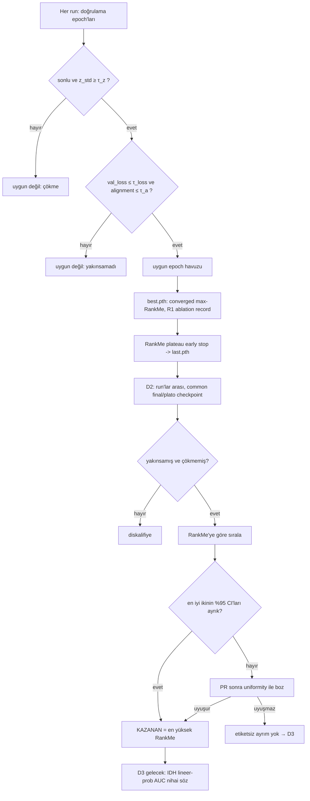

# Bildiri Taslağı — Etiketsiz Model Seçim Yöntemi (Methods)

> Bu, bildirinin ana katkısını anlatan **Yöntem** bölümünün prose taslağıdır. Teknik/uygulama
> ayrıntıları için `MODEL_SELECTION.md` (algoritma spesifikasyonu), gerekçeler için
> `DESIGN_JUSTIFICATION.md`. Atıf etiketleri belge sonundaki listeyle uyumludur.

## X. Etiketsiz Model Seçimi (Ana Katkı)

### X.1 Problem

Joint-embedding SSL'de (SimSiam) eğitim, girdiyi yeniden kurmaz; dolayısıyla başarısız bir
eğitimin görsel/kayıp tabanlı bir işareti yoktur ve — bizim aşamamızda IDH etiketi bulunmadığından
— encoder'ları bir doğrulama doğruluğuyla (accuracy/AUC) sıralayamayız. Bu koşulda "hangi backbone
daha iyi bir temsil öğrendi?" sorusuna **etiketsiz, tekrarlanabilir ve savunulabilir** bir yanıt
üretmek gerekir. Bu çalışmanın metodolojik katkısı, bu seçimi yapan **çökme-farkında, yakınsama-kapılı
ve belirsizlik-nicelenmiş** bir karar prosedürüdür.

### X.2 Etiketsiz metrik bataryası

Seçim, temsil kalitesinin birbirini tamamlayan etiketsiz ölçütlerine dayanır (tümü, sabit bir
doğrulama kohortu üzerinde precise-BN uyarlaması sonrası hesaplanır):

- **z_std** — temsilin batch içi standart sapması; **çökme (collapse)** göstergesi. Sağlıklı değer
  L2-normalize temsilde ≈ 1/√d; sıfıra yaklaşması tam çöküştür [ChenHe2021].
- **val_loss / alignment** — SimSiam negatif-kosinüs kaybı ve pozitif çiftlerin feature-uzayı
  yakınlığı; **yakınsama** (invaryansın öğrenilip öğrenilmediği) sinyali [WangIsola2020].
- **RankMe** — temsilin *effective rank*'ı; kaç boyutun gerçekten bilgi taşıdığı. Etiketsiz olmasına
  rağmen downstream lineer-prob başarısıyla güçlü korelasyon gösterdiği için **birincil kalite
  vekili** olarak alınır [Garrido2023].
- **participation ratio, uniformity** — sırasıyla ikinci bir efektif-boyutluluk ölçüsü ve temsilin
  hiperküre üzerindeki homojenliği; RankMe'yi **bağımsız formüllerle destekler** [WangIsola2020].

### X.3 Neden ağırlıklı toplam değil — leksikografik (kapılı) karar

Metrikleri tek bir ağırlıklı skorda birleştirmekten kaçınıyoruz, üç nedenle: (i) etiketsiz ortamda
ağırlıklar **keyfi** olur ve gerekçelendirilemez; (ii) çökme ve yakınsamama **ödünleşilebilir
büyüklükler değil, zorunlu koşullardır** — yüksek bir başka metrikle "telafi" edilemezler; (iii)
metrikler farklı ölçeklerdedir. Bunun yerine **katmanlı/leksikografik** bir prosedür kullanırız:
önce zorunlu **kapılar** (çökme yok, yakınsama var), ardından tek **birincil** metrik (RankMe) ile
sıralama, ve yalnızca *istatistiksel beraberlik* durumunda devreye giren **sıralı tie-break**
(participation ratio → uniformity). Her adım bir literatür referansına dayanır ve deterministiktir.

### X.4 Algoritma

Prosedür üç karardan oluşur (ayrıntı: `MODEL_SELECTION.md`):

**D1 — Run-içi checkpoint yönetimi.** Her doğrulama epoch'unda checkpoint, ancak (a) sonlu
metrikler ve z_std ≥ eşik (çökme yok) **ve** (b) val_loss ≤ τ_loss ve alignment ≤ τ_align
(yakınsamış) ise *uygun* sayılır. Uygunlar arasındaki en yüksek RankMe `best.pth` olarak saklanır;
yakınsama kapısı, rastgele başlangıcın yapay yüksek RankMe değerinin seçilmesini engeller. Ancak
çok-tohumlu ön analizimizde, bu ``converged max-RankMe'' kuralının (R1) ilk-yakınsayan, dik ve
seed-zamanlamasına duyarlı bir noktayı seçtiğini gözledik. Bu nedenle `best.pth`, korunmuş en
yüksek-rank aday olarak tutulur fakat backbone karşılaştırmasının karar checkpoint'i değildir.
RankMe iyileşmesi yakınsamış bölgede platoya girdiğinde erken-durdurma uygulanır ve `last.pth`,
tekrarlanabilir **final/plato checkpoint** olarak kaydedilir.

**D2 — Run-arası (backbone) seçimi.** Her run, aynı ortak kohortta yalnızca final/plato
`last.pth` ile değerlendirilir. Bu karar, R1 pikine göre daha düşük seed-varyansı ve sabit bir
ölçüm noktası verir; R1 sonuçları yalnız checkpoint-seçim ablasyonu olarak raporlanır.
Yakınsamayan/çökmüş run diskalifiye edilir; kalan final temsiller RankMe'ye göre sıralanır. Aynı
yapılandırmanın tohumları birlikte özetlenir. En iyi iki RankMe %95 güven aralığı ayrık değilse
*berabere* sayılır ve participation ratio, ardından uniformity ile bozulur (ikisi aynı yönü
göstermeli; göstermezse "etiketsiz ayrım yok" → D3'e bırakılır).

**D3 — Denetimli doğrulama (gelecek iş).** IDH etiketleri geldiğinde, 256-boyutlu öznitelikler
üzerinde katmanlı-CV lineer-prob/kNN AUC nihai ölçüttür ve etiketsiz vekili **ezer**; uyum varsa
vekil bu görev için doğrulanmış olur, yoksa fark raporlanır (vekilin dengesiz görevlerde
başarısız olabileceği uyarısıyla [Otero2024]).

```
Girdi: {run_i} , ortak doğrulama kohortu
D1 (her run için):
    her değerlendirme epoch'u e:
        if ¬finite(m_e) ∨ z_std_e < τ_z:       continue           # çökme -> uygun değil
        if val_loss_e > τ_loss ∨ align_e > τ_a: continue           # yakınsamadı -> uygun değil
        best.pth_i = argmax_e RankMe_e                              # R1; saklanır, karar noktası değildir
    last.pth_i = RankMe-plato erken-durdurması sonrası final checkpoint
D2 (run'lar arası):
    S = { run_i : last_i yakınsamış ∧ çökmemiş }                   # diskalifiye kapıları
    sırala S'yi RankMe(last_i) azalan
    kazanan = ilk;  berabere = { r∈S : CI(r) ∩ CI(kazanan) ≠ ∅ }
    if |berabere|>1: kazananı PR sonra uniformity ile boz (uyuşmazsa -> D3)
D3 (etiket gelince): 256-d üzerinde lineer-prob AUC  (etiketsiz vekili ezer)
```

### X.5 Belirsizliğin nicelenmesi

Etiketli bir sonuç olmadığından, çıkarımın gücü metriklerin istatistiksel sağlamlığına dayanır.
İki belirsizlik kaynağını raporlarız: (i) **kohort örnekleme** belirsizliği için RankMe/PR/uniformity
üzerinde **jackknife %95 güven aralığı** — sıradan bootstrap, tekrarlı-satır örneklemesiyle rank
istatistiğini aşağı saptırdığından bilerek kullanılmaz [Efron&Tibshirani1993]; (ii) **başlangıç/
augmentasyon** belirsizliği için her yapılandırma ≥3 tohum (seed) ile koşulur ve tohumlar-arası
%95 GA raporlanır. Bir backbone ancak güven aralığı diğerlerinden **ayrık** olduğunda kazanan ilan
edilir — ondalık bir farka göre değil.

### X.6 Katkı özeti

Önerilen prosedür, RankMe'nin bilinen iki tuzağını doğrudan ele alan, **etiketsiz, deterministik ve
belirsizlik-nicelenmiş** bir model-seçim yöntemidir: (1) rastgele başlangıçta RankMe'nin şişmesi —
yakınsama kapısıyla; (2) tek-başına-vekil olarak dengesiz görevlerde başarısız olması [Otero2024] —
üçgenleme (PR/uniformity/spektrum) ve nihai kararın denetimli prob'a bırakılmasıyla. 3D beyin-MRI
SSL'de backbone karşılaştırması, bu yöntemin çalışan bir gösterimidir.

---

### Şekiller (öneri)
- **Şekil A (akış diyagramı):** D1→D2→D3 kapılı karar akışı (aşağıdaki mermaid).
- **Şekil B:** RankMe ± (tohumlar-arası %95 GA) backbone bar grafiği (`select_model.py` üretir).
- **Şekil C:** RankMe yörüngesi vs epoch — boyutsal collapse'ın erken oluşup stabilize olması ve
  yakınsama-"dizi" checkpoint seçimi.
- **Şekil D:** singular-value spektrumu (düz = yüksek rank) + t-SNE (batch-effect kontrolü).



### Atıflar
- **[ChenHe2021]** Chen & He, *Exploring Simple Siamese Representation Learning*, CVPR 2021.
- **[WangIsola2020]** Wang & Isola, *Alignment and Uniformity on the Hypersphere*, ICML 2020.
- **[Garrido2023]** Garrido et al., *RankMe*, ICML 2023 (arXiv:2210.02885).
- **[Jing2022]** Jing et al., *Understanding Dimensional Collapse in Contrastive SSL*, ICLR 2022.
- **[Otero2024]** Otero et al., *Self-Supervised Anomaly Detection in the Wild* (RankMe'nin sınırları).
- **[Efron&Tibshirani1993]** Efron & Tibshirani, *An Introduction to the Bootstrap* (jackknife).
